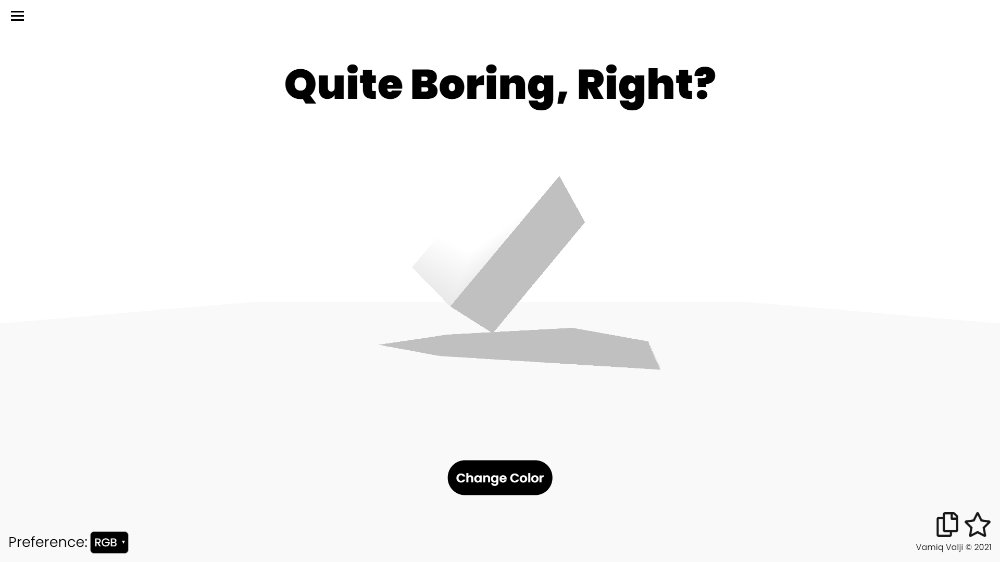
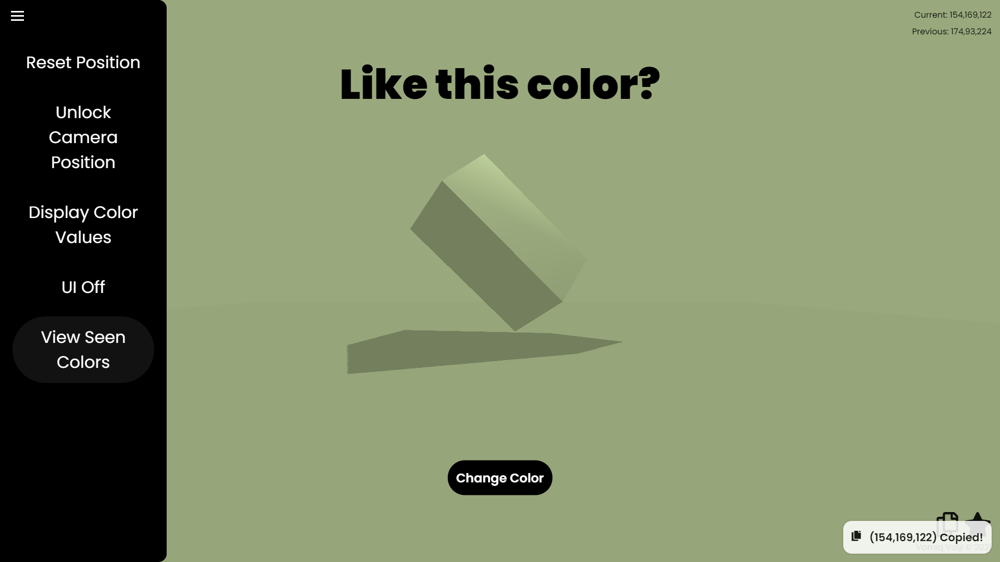
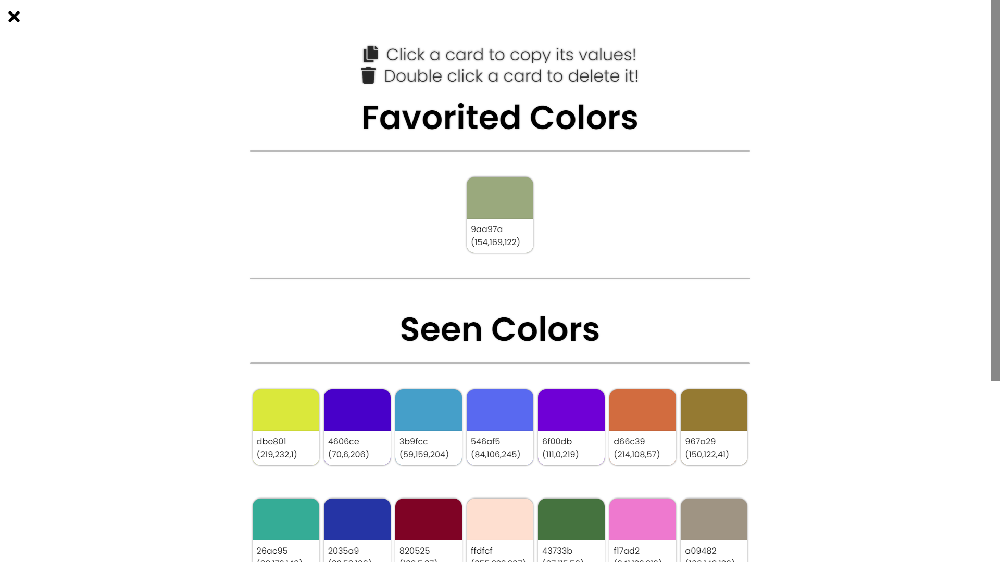

# 3D Color Picker

Projects's Purpose: To help the user find, save, and explore different colors that they can use in their own projects; through a 3D environment.

> Main Menu
> 
> Dropdown Showcase
> 
> View Colors Page
> 
> UI Off
> 

Current Version: 1.0 (Completed In About 12 Days)

This project may be further updated.

- Vamiq Valji
